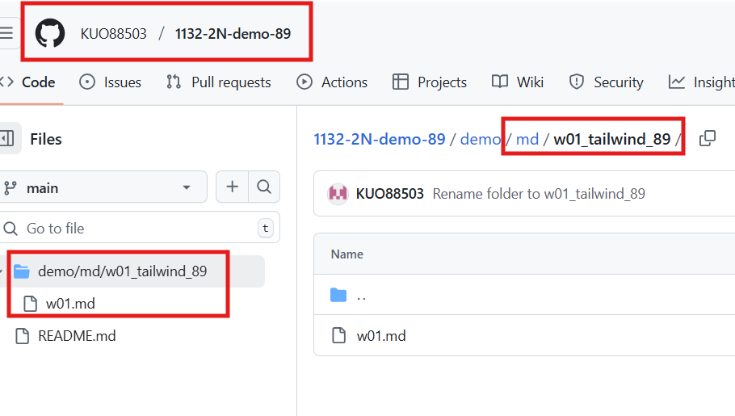

github[https://github.com/KUO88503/1132-2N-demo-89.git]

#### => Github repo


#### => share to teacher and TA


### W01-P2: Setup vite and tailwindcss, show your name and id


### W01-P3: Show Navbar_xx responsive from links data

#### => for screen size < 640px

#### => for screen size > 640px (small)


### logs
```
$  git log --pretty=format:"%h%x09%an%x09%ad%x09%s" --after="2025-02-18"
6fd00de kuo880503       Wed Apr 9 06:49:32 2025 +0800   W01-P3: Show Navbar_xx responsive from links data
177d130 kuo880503       Wed Apr 9 02:42:54 2025 +0800   W01-P2: Setup vite and tailwindcss, show your name and id
621d225 kuo880503       Wed Apr 9 02:21:43 2025 +0800   Rename folder to w01_tailwind_89
20212a5 kuo880503       Wed Apr 9 02:08:53 2025 +0800   W01-P1: Create a Github repo for 1132 semester
c1190d8 KUO88503        Wed Apr 9 00:59:14 2025 +0800   Initial commit
```